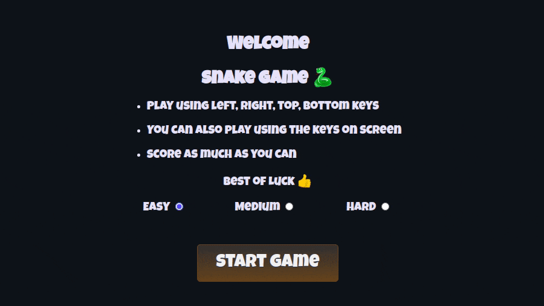

<h1 align="center">Snake Game</h1>

A browser-friendly, small-sized, good old snake game built on canvas using JavaScript. Play using the arrow keys or the keys drawn on screen.

  
  &nbsp;
  

  <a href="https://faisalakhtar.github.io/snake-game/">Play Game</a>
  ·
  <a href="https://github.com/faisalAkhtar/snake-game/issues/new/choose">Report Bug</a>
  ·
  <a href="https://github.com/faisalAkhtar/snake-game/issues/new/choose">Request Feature</a>

  
   
  The Snake Game

<h2 align="center">Built with :heart: and :sparkles:JavaScript:sparkles:</h2>
